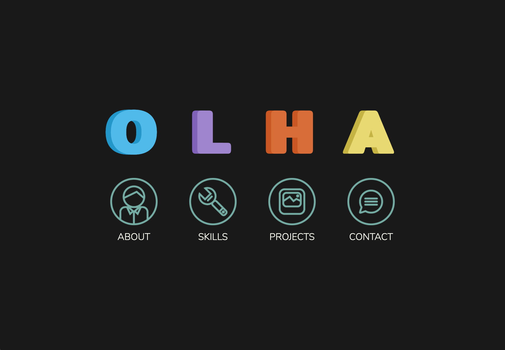
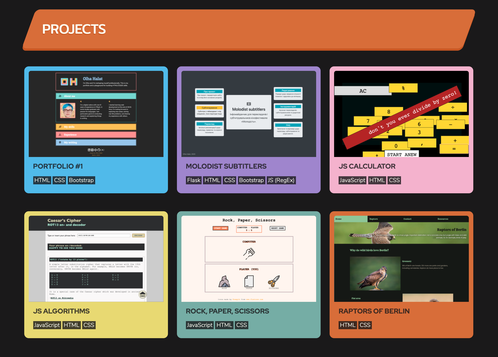
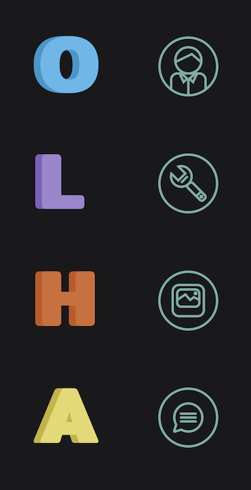
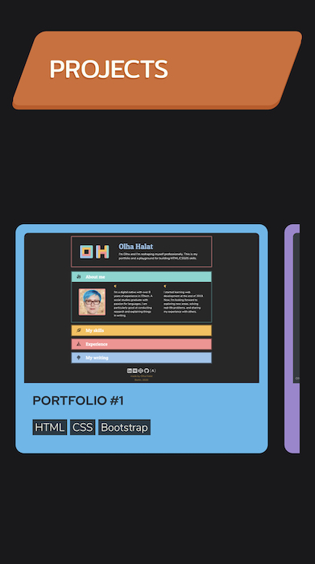

# OLHA's Portfolio

## About

I made this website as part of the UI Basics course at DCI Berlin and thought of it as a chance to make use of use of [olhanotolga.github.io](olhanotolga.github.io). This is also the first project where I used Sass.

## The idea

Instead of a logo or image, I decided to combine the letters of my name with colors.

## Stack

HTML, CSS (Sass/Scss), GitHub Actions.

## Development

The website is responsive thanks to CSS Grid (mainly), Flexbox, and media queries.

 

I use the Grid layout and `::before` pseudo elements to create the timeline on the About page.

I also aim to make my website accessible for everyone with the help of semantic HTML, aria attributes, and functional classes.

## Deployment

To compile Sass to CSS and publish the static assets to GitHub Pages, I set up a custom workflow (see the `.github` folder). The website is live at [olhanotolga.github.io](olhanotolga.github.io).

Previously I was accomplishing the same via Jekyll (see the legacy branch `jekyll`).
