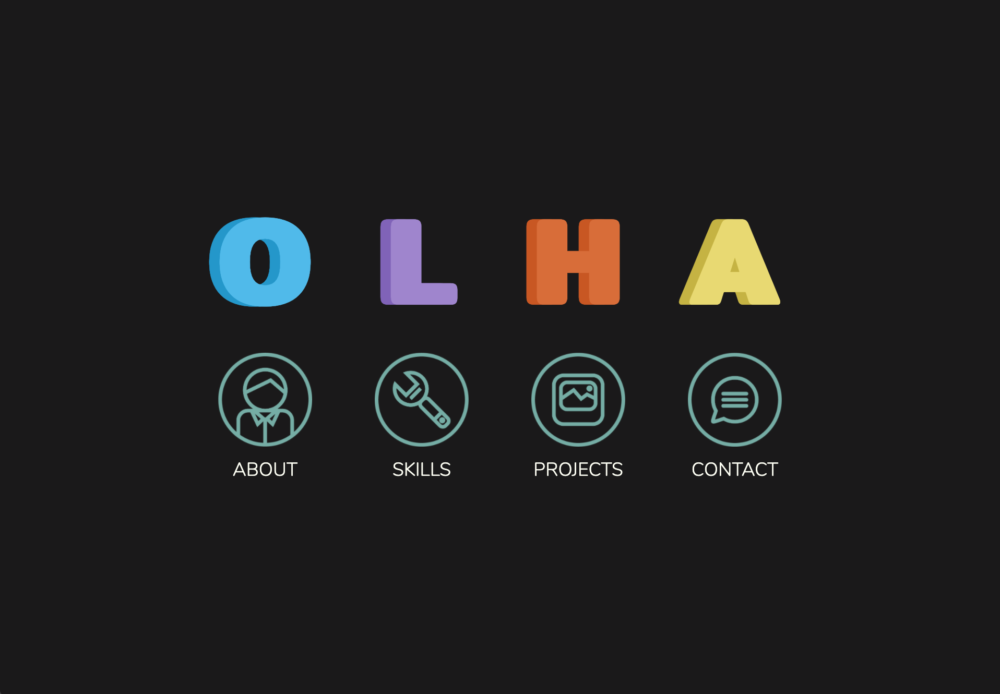

# OLHA's Portfolio

## About

I made this website as part of the UI Basics course at DCI Berlin and thought of it as a chance to make use of use of [olhanotolga.github.io](olhanotolga.github.io). This is also the first project where I used Sass.

## The idea

Instead of a logo or image, I decided to combine the letters of my name with colors.

## Stack

HTML, CSS (Sass/Scss).

## Development

The website is responsive thanks to CSS Grid (mainly), Flexbox, and media queries.

 

I use the Grid layout and `::before` pseudo elements to create the timeline on the About page.

I also aim to make my website accessible for everyone with the help of semantic HTML, aria attributes, and functional classes.

## Deployment

The website is live at [olhanotolga.github.io](olhanotolga.github.io) with some help compiling Sass into CSS from Jekyll (see the `jekyll` branch).
